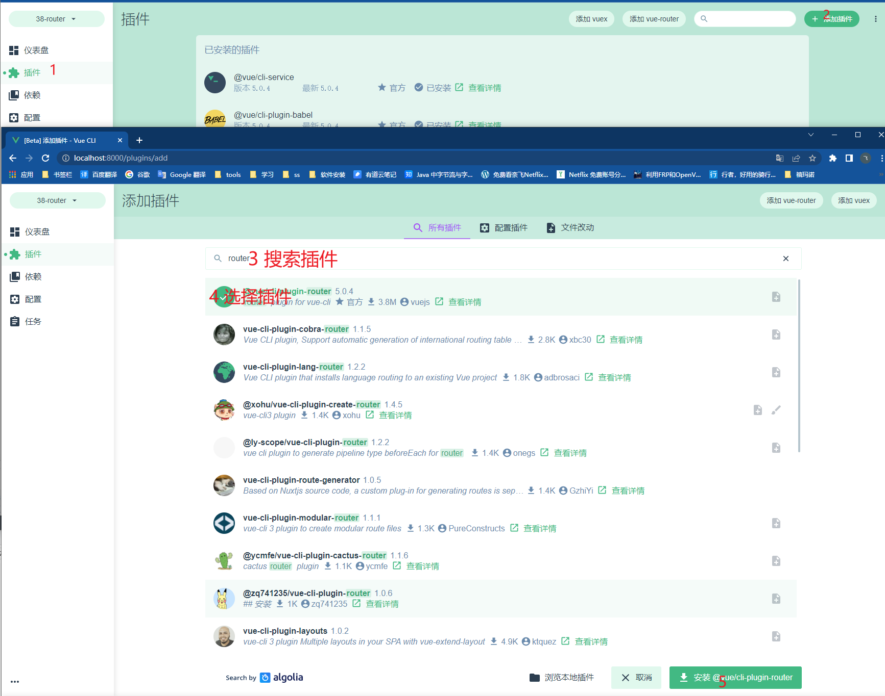

# vue的路由安装、模式、简单使用

### 路由的两种模式

HTML5模式，通过浏览器的`history`实现

Hash模式，通过URL中的哈希字符实现，例如`127.0.0.1/index.html#/home`，其中`#/home`就是哈希字符，这部分不会发送给服务器，则修改这部分浏览器不会发起请求。**它在 SEO 中确实有不好的影响**。如果你担心这个问题，可以使用 HTML5 模式。

### 新建项目安装路由

执行命令：`vue create 项目名`

选项说明：

1. 选择预设（Please pick a preset:）

   ```
   Default ([Vue 3] babel, eslint)		vue3内置babel, eslint
   Default ([Vue 2] babel, eslint)		vue2内置babel, eslint
   Manually select features			手动选择功能
   ```

   此处使用 手动选择功能

2. 勾选项目所需的功能，空格勾选，回车确认（Check the features needed for your project）

   ```
   ( ) Babel									js编译器可以将ES6转ES5从而支持更多浏览器
   ( ) TypeScript
   ( ) Progressive Web App (PWA) Support		这个好像是生成手机端的app
   ( ) Router									路由
   ( ) Vuex									
   ( ) CSS Pre-processors						Css预处理器，用了它可以支持Sass、LESS等
   ( ) Linter / Formatter						代码规范
   ( ) Unit Testing							单元测试
   ( ) E2E Testing								端到端测试
   ```

   选择 Router ，其他按需选择

3. 选择vue的版本

   ```
   3.x
   2.x
   ```

   选择3.x

4. 路由的模式

   ```
   Use history mode for router?
   ```

   Y：HTML5模式

   N：Hash模式

5. 选择配置文件的位置（ Where do you prefer placing config for Babel, ESLint, etc.? ）

   ```
   In dedicated config files		独立保存
   In package.json					放在package.json中
   ```

   选择独立保存，修改时方便

6. 是否将当前设置保存为预设

   ```
   Save this as a preset for future projects? (y/N)
   ```

   Y：保存预设，保存后在创建项目时会看到保存的预设

   N：不保存

### 旧项目可视化安装路由(不推荐)

1. 执行`vue ui`，允许可视化页面

2. 导入项目

   

3. 安装路由

   

4. 选择路由的模式

   


### 旧项目手动安装路由（推荐）

1. 打开终端，进入项目目录

2. 确定合适版本的路由，vue2使用router3、vue3使用router4

   1. 在 package.json 中查看项目的版本，我项目的版本是 `"vue": "^3.2.13"` 也就是vue3，使用router4

3. 安装router4

   1. 在终端支持 `npm install vue-router@4`

4. 配置router

   1. 在src下创建router目录，并添加index.js文件

      1. index.js文件内容

         ```js
         import { createRouter,createWebHistory,createWebHashHistory } from "vue-router";
         
         //路由的映射关系
         let routes = [
         ]
         
         //创建路由
         let router = createRouter({
           // 路由模式：HTML5模式
           history: createWebHistory(),
           //路由模式：hash模式
           // history: createWebHashHistory(),
           //映射关系
           routes
         })
         
         //导出路由
         export default router
         ```

   2. 在main.js中使路由生效

      1. 导入路由并在创建的vue中使路由生效

         ```js
         import router from './router'
         
         createApp(App)
         //使用路由插件
         .use(router)
         .mount('#app')
         ```

### 路由的简单使用

#### 路由的内置组件

- router-link

  - 用于路由的跳转，类似a标签不同的是router-link不会刷新页面

  - 属性

    - to：路由跳转的链接

    - replace：在历史记录中覆盖上一个链接，即不支持浏览器返回来源页

    - active-class：

      - 链接激活时（点击链接后），应用于渲染标签的class（默认值为router-link-active），可以通过该class设置样式，此设置优先于全局配置。

      - 该可以在router中通过`linkActiveClass`进行全局配置

        ```js
        ...
        //创建路由
        let router = createRouter({
          ...
          //映射关系
          routes,
          //激活链接时，应用于渲染标签的class
          linkActiveClass: "custom-active"
        })
        ...
        ```

- router-view

  - 将显示与 url 对应的组件

#### 修改App.vue使路由对应的组件可以展示

```html
<template>
  <div>
      <router-view></router-view>
  </div>
</template>
```

#### 路由的映射

##### 创建两个测试文件

- home.vue

  ```html
  <template>
    这是首页
  </template>
  ```

- about.vue

  ```html
  <template>
    这是关于
  </template>
  ```

##### 在router/index.js中配置其映射关系

```js
...
import home from "@/views/home"
import about from "@/views/about"

//路由的映射关系
let routes = [
  {
    path: "/home",
    component: home
  },
  {
    path: "/about",
    component: about
  }
]
...
```

##### 使用`router-link`跳转

App.vue中添加跳转

```html
<template>
  <router-link to="/home">首页</router-link>
  |
  <router-link to="/about">关于</router-link>
  <div>
      <router-view></router-view>
  </div>
</template>
```

##### 根路径（`\`）的处理

路由中配置其重定向

```js
//路由的映射关系
let routes = [
  {
    path:"/",
    redirect: "/home"
  },
  {
    path: "/home",
    component: home
  },
  ...
]
```


[示例项目](./scaffolding/38-router-install)