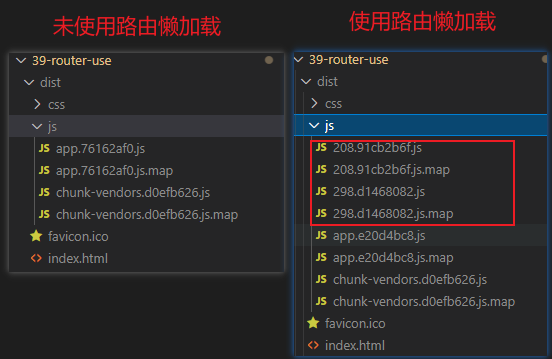
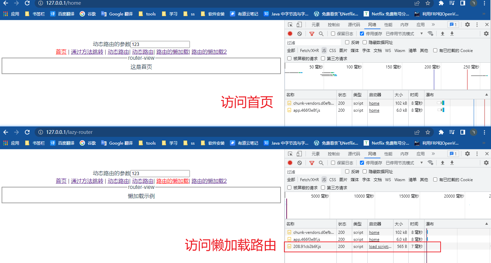
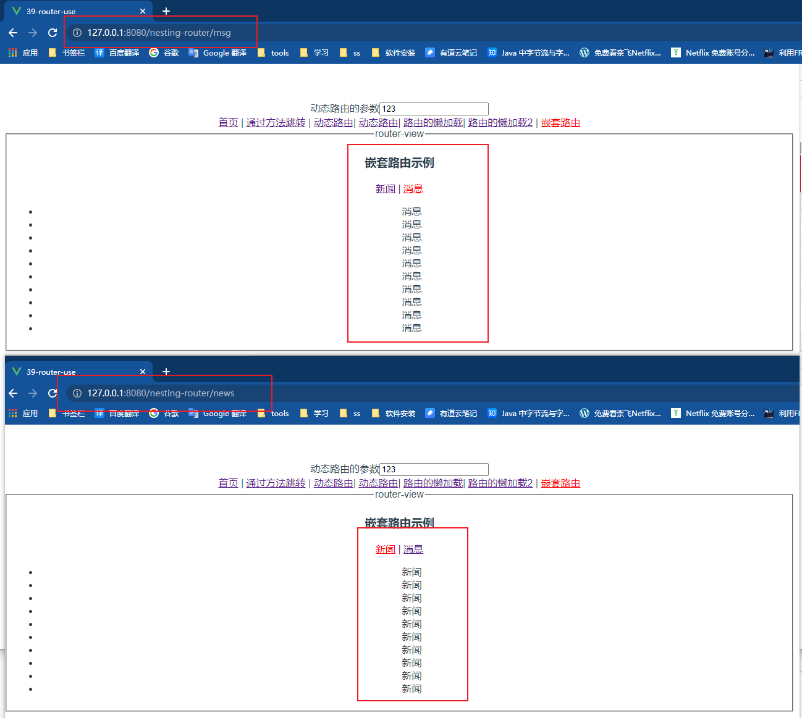

# vue路由的使用

### 通过js代码跳转

vue提供了`this.$router`与创建的路由完全相同，可以通过`this.$router`的push方法与replace方法进行跳转

#### push方法

在历史记录中推送一个链接，并从路由中获取对应的组件进行加载

示例：

```js
methods:{
  pushMeth(){
    this.$router.push("/home")
  }
}
```

#### replace方法

在历史记录中推送一个链接，并从路由中获取对应的组件进行加载

示例：

```js
methods:{
  replaceMeth(){
    this.$router.replace("/home")
  }
}
```


[示例代码](./scaffolding/39-router-use/src/views/method-jump.vue)

### <div id="dynamic"></div>动态路由的使用

#### 参数定义

在路由映射关系的path中的定义参数，格式为`:参数名`，例如参数名为id那么就是`:id`

```js

let router = createRouter({
  ...
  //映射关系
  routes: [
      {
        //:id 代表动态路由中的id参数
        path: "/dynamic-route/:id",
        component: dynamicRoute
      }
    ]
  ...
})
```

[示例代码](./scaffolding/39-router-use/src/router/index.js)

#### 参数接受

vue提供了`this.$route`代表当前展示的路由，可以用来获取参数等

在对应的组件中，通过`this.$route.params.id`来获取id参数

```js
export default {
  computed:{
    id(){
      return this.$route.params.id
    }
  }
}
```

[示例代码](./scaffolding/39-router-use/src/views/dynamic-route.vue)

#### 参数传递

router-link示例：

```html
<template>
  <router-link :to="'/dynamic-route/'+id">动态路由</router-link>
</template>
<script>
export default {
  data(){
    return{
      id: 123
    }
  }
}
</script>
```

[示例代码](./scaffolding/39-router-use/src/App.vue)

### <div id="lazy"></div>路由的懒加载

#### 懒加载的作用

vue打包时会将所有组件放在一个js中，随着业务的增长组件越来越多，这个js文件会越来越大，这样会导致浏览器在加载这个js时时间变长，页面出现短暂的空白，体验极差，这时后就需要懒加载将组件剥离开分成多个js文件，来解决这个问题。

路由的懒加载最终可以将一个组件或或者多个组件加载到一个独立的js文件中，在使用到对应组件是才加载js。

#### 懒加载写法

```js

const routerLazy = () => import("@/views/router-lazy")

//路由的映射关系
let routes = [
  {
    path: "/lazy-router",
    //路由的懒加载
    component: routerLazy
  },
]

//创建路由
let router = createRouter({
  //映射关系
  routes,
})
```

#### 懒加载请求分析

##### 打包文件分析



可以看到多出来两套文件 这是使用了两个懒加载的路由

##### 请求分析



在请求首页时只加载了必要文件，当请求懒加载路由时请求了对应的js

[示例代码](./scaffolding/39-router-use/src/router/index.js)


### <div id="nesting"></div>嵌套路由

#### 适用场景

- 手机端的底部导航，点击不同导航显示不同的页面

#### 语法

router/index.js

```js
const nesting = () => import("@/views/nesting-router")
const nestingNews = () => import("@/views/nesting-router-news")
const nestingMessage = () => import("@/views/nesting-router-message")

//路由的映射关系
let routes = [
  {
    path:"/nesting-router",
    component: nesting,
    //嵌套路由
    children:[
      {
        //默认展示 nestingNews 组件
        path:"",
        redirect:"/nesting-router/news"
      },
      {
        path:"news",
        component: nestingNews
      },
      {
        path:"msg",
        component: nestingMessage
      },
    ]
  }
]

//创建路由
let router = createRouter({
  //映射关系
  routes,
})
```

#### 截图示例



[示例代码](./scaffolding/39-router-use/src/router/index.js)

### <div id="query"></div>参数传递

#### 跳转时携带参数

参数通过url中的query进行传递，也就是url中?后的key=value，例如：http://127.0.0.1:8080/adb/123?a=1&b=2，其中 ?a=1&b=2 就是query。

##### router-link标签内传参

```html
<router-link :to="{path:'/query',query:{name:'ersut',age:18}}">参数传递</router-link>
```

其中 `{name:'ersut',age:18}`就是传递的两个参数，注意由于这里是对象所以需要v-bind即`:to`

##### 在js内跳转时传递参数

```js
this.$router.push({
    path:"/query",
    query:{
        name:"ersut wang",
        age:19
    }
})
```

与标签内一样都是使用对象

#### 组件内接收参数

通过官方提供的$route获取参数

```js
this.$route.query.name
this.$route.query.age
```

#### 使用props对组件传参解耦

在组件内直接获取参数导致组件与路由高度耦合，可以配合上props进行解耦

##### 在路由中开启props传参

```js
const query = () => import("@/views/query")

//路由的映射关系
let routes = [
  {
    path: "/query",
    component: query,
    //使用props对组件传参解耦
    props: route => route.query
  },
]

//创建路由
let router = createRouter({
  // 路由模式：HTML5模式
  history: createWebHistory(),
  //映射关系
  routes,
})
```

##### 组件中接收props

```vue
<template>
<h3>使用prop传递参数</h3>
<h4>姓名：{{name}}</h4>
<h4>年龄：{{age}}</h4>
</template>

<script>
export default {
  props:{
    name:{
      type: [String],
      default: ""
    },
    age:{
      //当组件的props通过路由传递时务必要加上String类型，因为从地址栏中获取的参数都是String类型
      type: [String,Number],
      default: 0,
      validator(value){
        return value > -1;
      }
    }
  }
}
</script>
```

这样在组件中就不再使用路由了完成解耦

[示例代码](./scaffolding/39-router-use/src/views/query.vue)