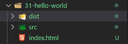

# 基本使用

> [示例项目](./31-hello-world)

### 项目结构

项目分为src文件夹和dist文件夹：

- src文件夹：源码目录，开发都在这个目录中进行
- dist文件夹：distribution的缩写，这里放的是要发布的代码（打包后的代码）
- 根目录存放index.html文件
- 

### 使用

[commonJs导出](./31-hello-world/src/commonjs-module.js)：

```js
const helloWorld = "hello world"

// commonjs规范导出
module.exports = {
  helloWorld
}
```

[ES6导出](./31-hello-world/src/es6-module.js)：

```js
const _webpack = "webpack"

export {
  _webpack
}
```

[入口文件：commonJs和ES6的导入](./31-hello-world/src/main.js):

```js
//commonJs导入
let {helloWorld} = require("./commonjs-module")

console.log(helloWorld);

// ES6导入
import { _webpack } from "./es6-module";

console.log(_webpack + " " + helloWorld);
```

以上代码在浏览器中无法识别的需要webpack打包

**注意**：一个文件中只支持一种导出规范

#### 打包

1. 在终端进入项目的根目录，本示例项目中是31-hello-world目录

2. 执行打包命令(webpack4+)：`webpack ./src/main.js -o ./dist`

   1.  `./src/main.js`代表要打包的文件，webpack会帮我们解决依赖关系（即es6-module.js和commonjs-module.js），所以这里我们只写入口文件
   2. `-o ./dist`代表打包后的文件输出的目录

3. 在index.html中引入打包后的文件进行使用

   1. ```html
      <body>
        <script src="./dist/main.js"></script>
      </body>
      ```

