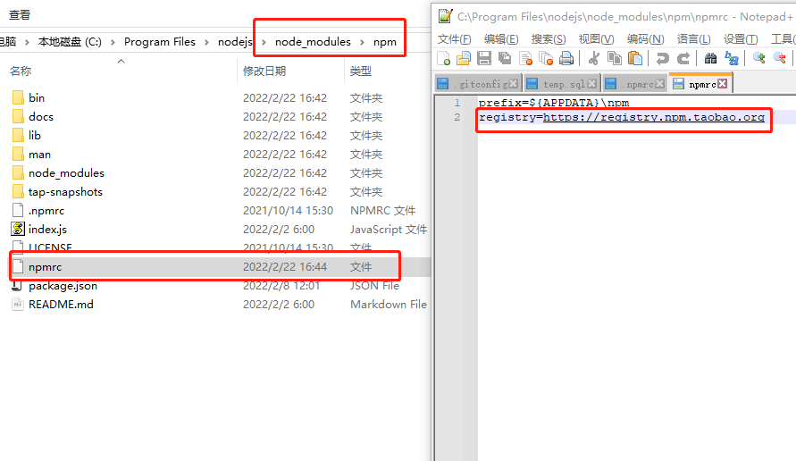
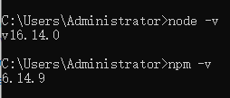

# webpack的介绍与安装

## 介绍

### 什么是webpack

webpack是模块打包工具，它可以分析你工程中的模块，并构建出模块的依赖关系，最终将这些模块打包成一个浏览器可执行的文件。

白话：目前模块化规范有CommonJS、AMD、CMD以及ES6，但是浏览器可以识别的只有ES6，那么其他的几个规范就需要一个载体来解析（或者说转换为浏览器可识别的语法），这个载体就是webpack

### webpack有哪些的优点

优点就是支持模块化，并处理了模块之间的依赖关系（程序员不用过多的关心依赖关系）。

## 
安装

webpack依赖nodeJs需要先安装node.js

### nodeJs安装

1. 根据系统[下载node.js安装包](https://nodejs.org/zh-cn/)
2. 运行安装包安装（一直下一步即可）
3. 配置国内镜像源
   1. nodeJs安装目录\node_modules\npm\npmrc文件中，增加  registry=https://registry.npm.taobao.org
   2. 
4. 命令行测试
   1. 打开新的终端
   2. 输入`node -v`后回车，显示对应的版本号即为安装正确
   3. 输入`npm -v`后回车，显示版本号即为安装正确
   4. 

### webpack安装

#### 命令安装

通过npm来安装webpack，命令：`npm install webpack@3.6.0 -g` 

`-g`为全局生效

`@3.6.0`为指定版本安装

**注意**：如果安装版本大于4+，还需要安装webpack-cli，命令：`npm install -g webpack-cli`

#### 测试

通过命令行输入`webpack -v`，显示对应的版本号即为安装正确

